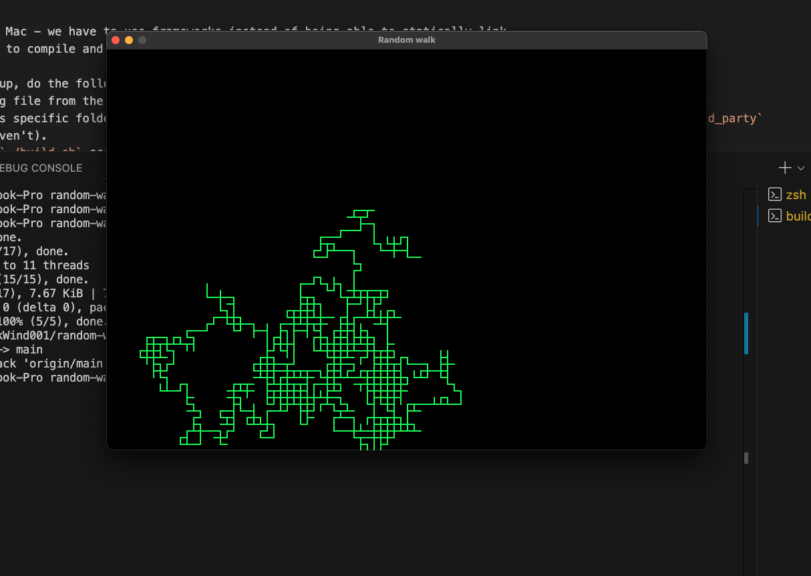
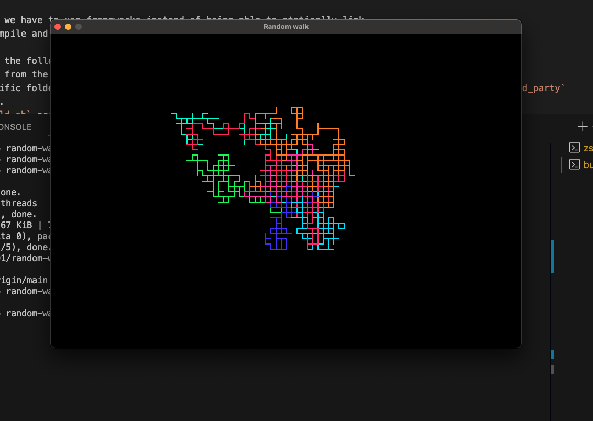
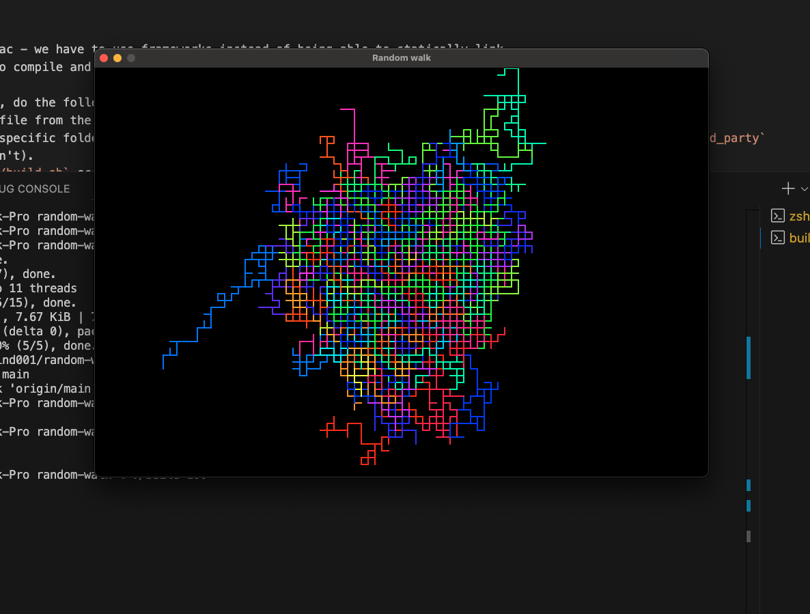
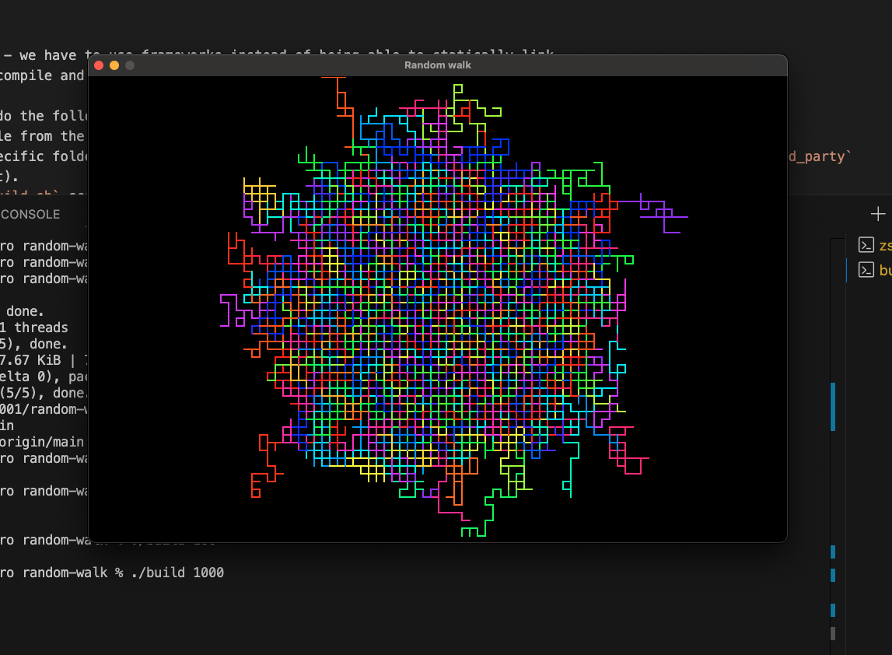

### Why?

Cause I wanted to have fun with programming again and the endgoal on [this stream](https://www.youtube.com/watch?v=ErA4U9WqNCE) seemed nice.

### Setup

Setup is a bitch on Mac - we have to use frameworks instead of being able to statically link.
The other option is to compile and build SDL myself and get the .dyslib file which I don't plan on doing.

So, in order to setup, do the following:
1. Download the .dmg file from the official SDL release page
2. Extract the macos specific folder into the `third_party` directory under the root project directory. (Create the `third_party` directory if you haven't).
3. Try running the `./build.sh` script. If it works, lovely.
4. If you get an error saying that "Apple could not verify “SDL3.framework” is free of malware that may harm your Mac or compromise your privacy", then run `xattr -r -d com.apple.quarantine SDL3.framework` in the `third_party` directory.

Intellisense does not work. Dunno why.

### Preview

